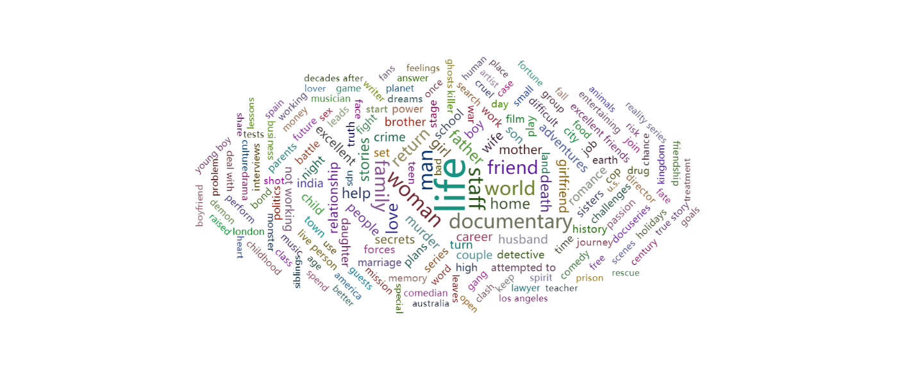
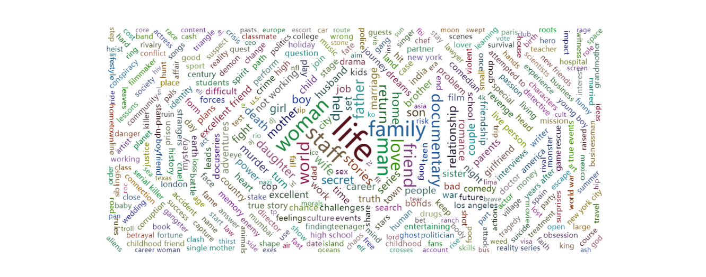

# OTT Platform Analysis Tool
* This tool is to show how well the OTT platforms have 
performed so far
## Netflix data
* Basic analysis on netflix data and reviews are analyzed with help of customer statisfaction opinions resource in IBM Watson.
* Current Analysis is on 25 % data.
### Word Cloud

* Above word cloud is from the Anaylzed data, which provides the count of words which are conceptually 
sensible
* When WordCloud was given a deeper analysis we attain the following graph
#### In depth-Word Cloud

* Lead roles was used too much, which can be conclusion of how in general public talks about the protagonist/antagonist much more than side roles
* Meanwhile "friend","family" were also used in greater %.
### PieChart of Reviews

* Pie Chart shows the distribution of audience in general on the platform(Netflix)
* Showing maximum as Negative(Sad) Content is not likeable
* But there isn't much differnce between negative and positive maintaining a netural status.
### Tree Based Analysis

* Different Watch ratings shown with whether the "content" is a Movie or T.V. Show.
* It is amazing that Movies are distributed in all categories meanwhile most T.V. Shows are at least 13+.
### PieChart on Netflix

* More than 50% of movies/ T.V. shows in Netflix are from U.S.
* Showing how dominant the Hollywood industry in OTT platforms.
* And next comes Indian Content which has 22% presence in the dataset(25 % sampled).
### Distribution of Words in Reviews

* The above Graph shows Positive reviews has "love" word used dominantly.
* Some of the words include "love","excellent","rich","large".
* Intresting "love" was used 868 times out of 3380 uses, which is 25.68 %.
### 75 % Word Cloud

* When 75 % data was considered Word Cloud changed, Which introduced some new words into light
* In the above cloud, which shows life, family, women and staff are top 4 topics
* Considering the limit of data collected from 1900 to 2020, life was most sought out topic
* Family and Women came up after 2004 and so.
### Scatter plot

* This helps to determine which years were dominant in production of content.
* Also gradient of points define how much the content is famous.
* We can see from graph that T.V. shows were around 118 mins long or 4 seasons mostly.
* Also domination of 2000 to 2020 is fantastic in content production
* While most points lies on 80 to  140 mins, showing the length of movie/T.V. shows not less than 1:20 hrs and greater than 2:20hrs on average
* Intrestingly a T.V. show was made in early 1940s which seems to be earliest T.V. Show.
## Amazon Prime Data
* The sample is 66% taken randomly out the dataset
* Below are the Graphs and what analysis of data shows is listed below
### BarChart for Year and Maturity

* The above barchart shows the distribution of T.V. shows/ Movies based on year Split with Maturity rating
* Most movies made every year are 13+.
* Concerntration of most movies are from (2016-2020)
* Intrestingly most 18+ movies are made in 2016.
### TreeMap on Maturity vs Language

* From the above Tree Map we can see "English", "Hindi" and "Tamil" have made Shows/Movies in all categories of Maturity.
* Meanwhile "Punjabi" has Only two categories that are "13+" and "All"
* As from the above Bar Chart 13+ is dominant which is evidently shown in the treemap.
## Language vs Maturity explained with relations

* This is more insightful than TreeMap, and thus provides more deeper view of  films/TV.shows.
* Shows how language affects the maturity rating of the content
* Notice 13+ as the biggest bubble with NR as second most occuring maturity type
* Also Hindi,English are two dominant languages in the Amazon dataset.
* Most 18+ are made in English,Hindi and Tamil. 
### 3D Scatter Chart

* The above chart shows how 3 factors relate to each other graphically, and cocerntration of points in the place
* We can see that 7.5 was the modal rating with English,Telegu,Bengali,Tamil languages
* Also we see that each movie or T.V. show was 1:30 hrs to 2:00 hrs long in the Concerntrated area
* A Tamil movie had a rating of 1.4, which can conclude that there is an outlier, also highest rating is 8.9.
* There is maturity diversity, but mostly 13+,16+ and 18+ categories are dominant.